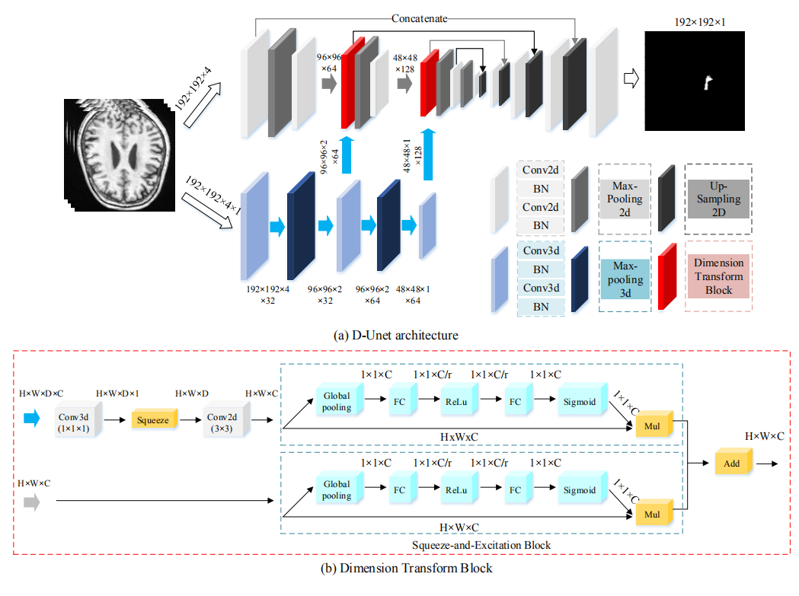

# D-UNet
D-UNet: a dimension-fusion U shape network for chronic stroke lesion segmentation
 
# Author
Weijian Huang
# 项目简介
## 1. 功能
分割脑卒中
## 2. 性能
代码的性能，比如资源占用，准确率等。
## 3. 评估指标
DSC(Dice Similarity Coefficient)、Recall、Precision
比如mAP等。
## 4. 使用数据集
ATLAS（Anatomical Tracings of Lesions-After-Stroke dataset）

# 运行环境与依赖
代码运行的环境与依赖。如下所示：
We have trained the models on three 1080TI GPUs
|类别|名称|版本|
|-----|-----|-----|
|os|ubuntu|16.04|
|深度学习框架|tensorflow|1.1.0|
||opencv|3.4.9|

# 输入与输出
代码的输入与输出。如下所示：

|名称|说明|
|-----|-----|
|输入|3D灰度图像。大小为192X192X4（宽x高x切片数）|
|输出|分割结果。0表示背景，1表示脑卒中区域|


# 运行方式
在terminal下运行以下命令。
```shell
cd project_dir
python .\main.py --arg1 arg1 --arg2 arg2
```
